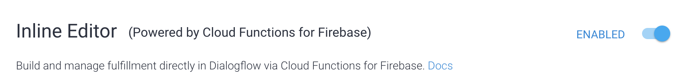
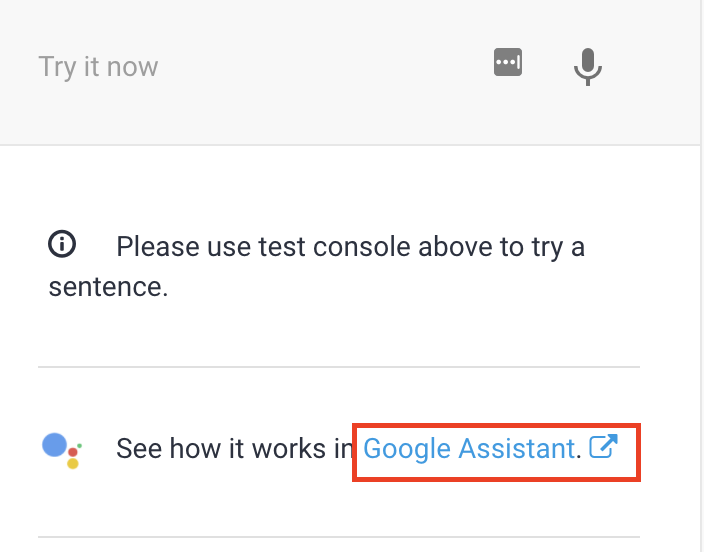
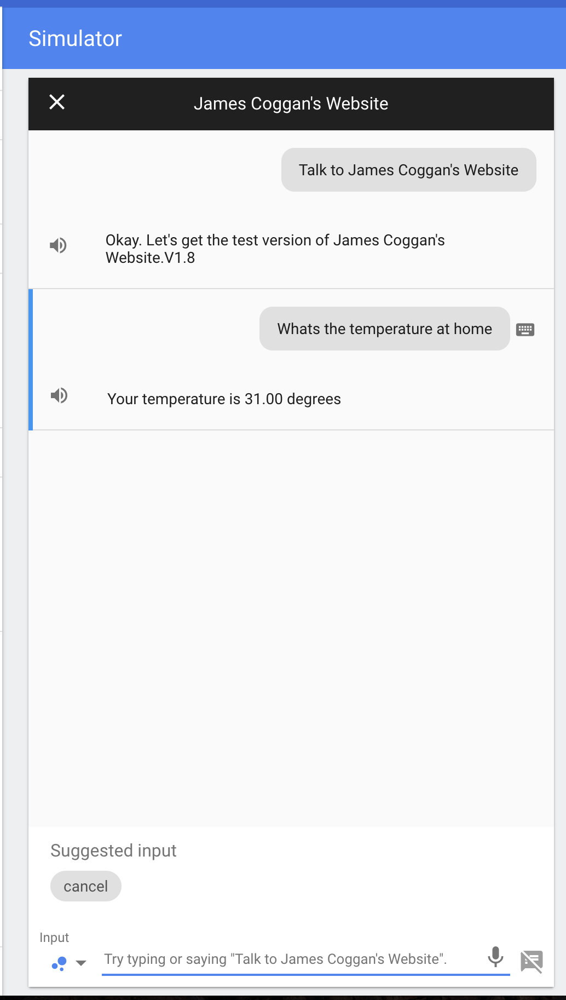
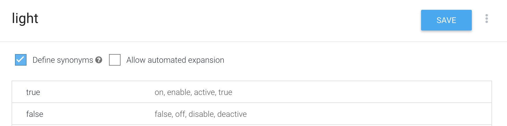
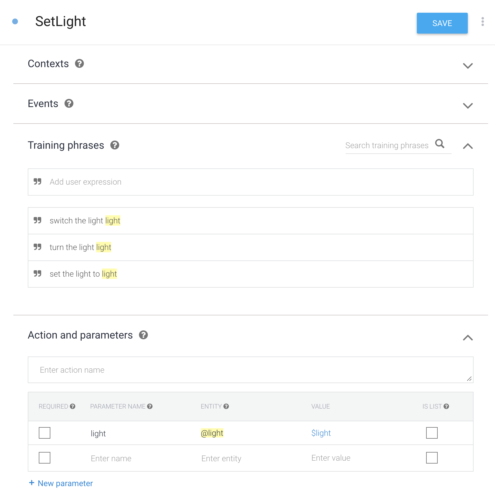
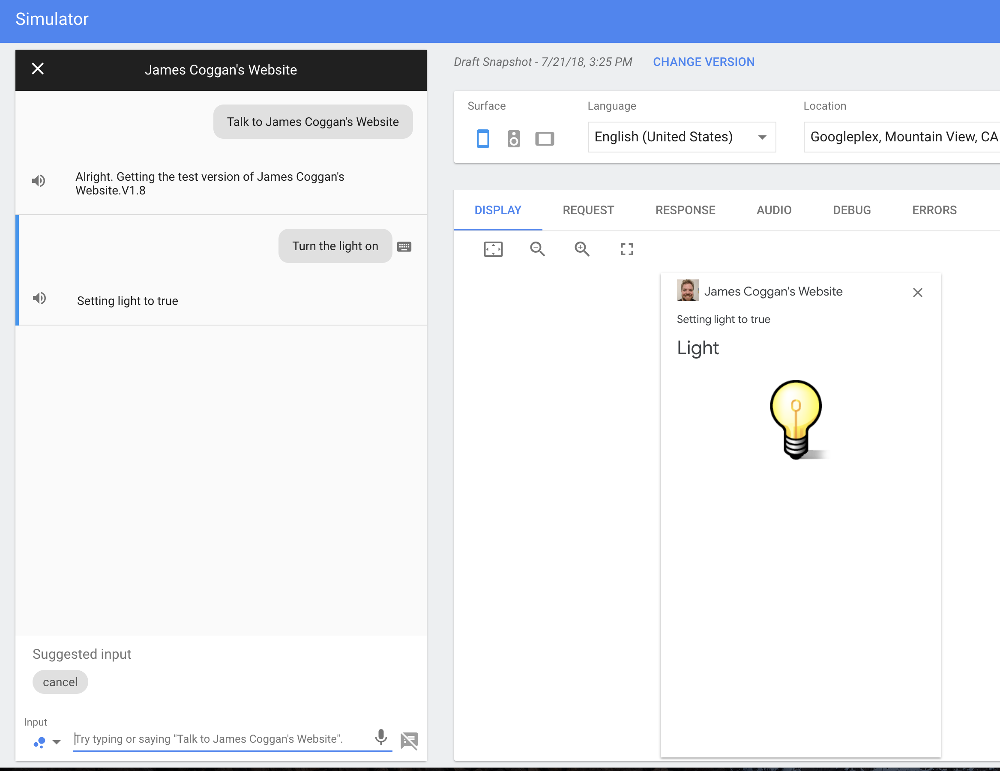

## Intro

The Google assistant uses machine learning to convert your voice commands to text. Thats is great, but you also need a tool to convert those text phrases to something more usable, because you don't want to need to handle every specific phrase a person says.

Dialog flow does exactly that, it will use machine learning to convert those phrases into a meaningful intent.

## Creating your DialogFlow project

Now that we have our DialogFlow function, we can create a project to use it

- Open the [DialogFlow console](https://console.dialogflow.com)
- Create a new agent
- Link it to your the same Firebase project your Android Things is connected to
- Make sure V2 API is selected

## Creating a new intent

- Create a new intent for our temperature read called `Temperature`
- Add some training phrases so DialogFlow can use the machine learning to detect the users intent


- Select fulfillment
- Enable the webhook


- Save

## Enabling you Fulfillment

- Open the Fulfillment tab
- And enable the Inline editor



The inline editor allows you to create a Google cloud function directly on your browser without the need of the firebase client or `Node.js` installed in your machine.

Before we can deploy your function, we need to configure it.
Open the `package.json` tab on the inline editor and replace the entire content with the code below

```JSON
{
  "name": "dialogflowFirebaseFulfillment",
  "description": "This is the default fulfillment for a Dialogflow agents using Cloud Functions for Firebase",
  "version": "0.0.1",
  "private": true,
  "license": "Apache Version 2.0",
  "author": "Google Inc.",
  "engines": {
    "node": "~6.0"
  },
  "scripts": {
    "start": "firebase serve --only functions:dialogflowFirebaseFulfillment",
    "deploy": "firebase deploy --only functions:dialogflowFirebaseFulfillment"
  },
  "dependencies": {
    "actions-on-google": "2.2.0",
    "firebase-admin": "~5.12.1",
    "firebase-functions": "^1.1.0",
    "dialogflow": "^4.0.3",
    "dialogflow-fulfillment": "0.4.1"
  }
}
```

Now go back to the `index.js` tab and replace the entire content with the code below:

```javascript
'use strict';

const functions = require('firebase-functions');
const {
    dialogflow,
    BasicCard,
    Button,
    SimpleResponse,
    BrowseCarousel,
    BrowseCarouselItem,
    Permission,
    Confirmation,
    MediaObject,
    Suggestions,
    NewSurface
} = require('actions-on-google');

const app = dialogflow({
    debug: true
});

const admin = require('firebase-admin');
admin.initializeApp(functions.config().firebase);

exports.dialogflowFirebaseFulfillment = functions.https.onRequest(app);

app.intent('Temperature', (conv) => {
    return admin.database().ref('/home').once('value', (snapshot) => { // Read the home object once from the database
        let result = parseFloat(Math.round(snapshot.val().temperature * 100) / 100).toFixed(2); // Conver the value to float
        conv.ask(new SimpleResponse({ // Create a new simple response and add it to the conversation
            speech: "Your temperature is " + result + " degrees",
            text: "Your temperature is " + result + " degrees"
        }));

    });
});
```

If you have a close look at line 27, we are adding and intent handle for the `Temperature` intent.
The lambda function will then be triggered and read the `home` database reference once.
With the result we can get the temperature object and return it to the conversation with a Simple response.

Now you can deploy your new cloud function!

Once deployed, we can test it with the Google Assistant!



Select the Google assistant on the right of the screen

- Type or click `Talk to my test app`
- And add what is the temperature at Home

You will get something similar to This:



## Setting a value in the database using Google assistant

Now that you know how to read a value from the database, time to set one.
In this example we will set the light value to true or false, making the LED on the Android Things kit go on or off.

Before we can create the intent to turn the light on, we need to have an entity to map the on and off values.

- Open the `Entities` tab on the DialogFlow project
- Add a new Entity called `light`
- Create the `true` entry and add some synonymous like `on`, `enabled`, `active`, etc
- Create the `false` entry and add some synonymous like `off`, `disabled`, etc

Your entity will look like below:



Now we can create the new intent with the new `light` Entity.
To do that, you need to add the training phrases as before, but when adding them, make sure to consider the `light` entity, so instead of using `Switch the light to true` you will use `Switch the light to light`.
Once the training phrases are added, you can click the `light` word and link it to the `Light` entity.
So do the following:

- Create a new Intent called `SetLight`
- Add some training phrases
- Link the `Light` entity to the light word

Here is how it should look:



Make sure to enable the fulfillment for this intent also:


Now we need to add the code in our cloud function.

Head back top the fulfillment tab in the DialogFlow project.
And add the new intent handler:

```javascript
app.intent('SetLight', (conv, params) => { // Function to handle the SetLight intent
    let value = params['light']; // Read the light parameter
        return admin.database().ref('/home/light').set(value).then(()=>{ // Set the parameter in the database
            conv.ask("Setting light to " + value);
            var image = ""; // To make it fancy, lets create a response with an image
            if(value === 'true'){
                image = "https://raw.githubusercontent.com/jamescoggan/AndroidThingsWorkshop/master/images/light_on.png";
            } else {
                image = "https://raw.githubusercontent.com/jamescoggan/AndroidThingsWorkshop/master/images/light_off.png";
            }
            conv.ask(new BasicCard({ // Now display a card with the image
            title: "Light",
            image: {
                url: image,
                accessibilityText: "Light" + value
            },
        }));
        });
});
```

Go ahead and deploy the function.

And now we can test it:


As you can see, when we request the set light, it will set the light in the database and also return a nice image with the light on.
If you do the same, but set the light to off, it will return and image with a light off and also set it in the database.
If you got your Android Things kit still connected, it should be switching the LED on and off from your command.



## Congratulations

Congratulations! You have now your Android Things kit fully connected to Google Assistant.
If you have got a phone that is also connected to the same Google account, you can go ahead and open the Google assistant on it and trigger your new action with `Talk to my test app`

Please send any feedback you have to `james.coggan` at `gmail.com`
