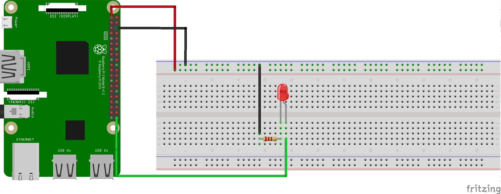
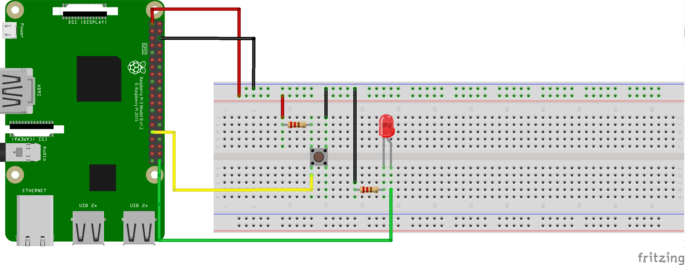

### Introduction

In this first task you will use AndroidThings to turn on an LED. This will be our way to get something basic running, a bit like a Hello World program. Although it may sound simple, turning on an LED is a good way to get yourself familiarised with the IoT board, hardware components as well as the AndroidThings environment. It will also give you an introduction on creating circuits that interact with the real world! Before you get started, here is a list of components you will need for this exercise.


### Hardware Components

1. Breadboard

    A breadboard is the construction base for all your electronic circuits. It provides an easy way to connect your components without requiring soldering. As per the breadboard diagram, the holes in the centre are connected by conductive metal strips horizontally while the holes on the edges are connected vertically.
    


2. Jumper wires

    Generic all purpose wires used to connect your board to the components on the breadboard together.

3. Resistors

    Essential parts of your electronic circuit as they primarily protect your components by limiting the amount of current flowing through them. Each component has a maximum current that it can handle and if the current going through them exceeds their rated value, they will get damaged and in some cases blow up! The resistance of a resistor is determined by the stripes. For this task, the resistor used will have a resistance of 220Ω

4. LEDs

    LED stands for Light Emitting Diode and it will emit light when a current flows through them. LEDs only allows electricity to flow in one direction meaning that they will only light up if connected with the correct polarity. The short leg of the LED is the cathode (-ve) and the long leg is the anode (+ve). The anode is the end that connects to power. Note that LEDs can only handle a maximum current of about 23mA

### Ohm's Law
Ohm's Law comes in very handy when designing electronic circuits and deciding how to connect our components. It states that the current through a conductor between two points is directly proportional to the voltage across the two points whereby the constant of proportionality is the inverse of electrical resistance. I = V/R
Ohm's Law will help us to select an appropriate resistor to protect our LED.

### GPIO Pins
GPIO (General Purpose Input Output) pins give a physical interface between your board (Raspberry Pi or other Android Things supported boards) and the breadboard. GPIO pins allow you to read and write values to the various sensors that you would use throughout your various IoT projects and interact with the real world. The pin layout varies depending on the board manufacturer but all you need to do is refer to the board's pinout diagram.

Below is an example of the pinout diagram for the Raspberry Pi 3 and the Pico i.MXP7:


For more information please visit: https://developer.android.com/things/hardware/index.html

### Blinking LED Android Things Circuit
The diagram below illustrates how to build your first circuit for this blinking LED exercise. The first diagram shows how to connect your components together. Very often, the actual physical representation of the circuit connection is not clear due to how the components and pins are arranged on the board. In order to make this easier to understand, the schematic diagram is provided underneath. A schematic diagram aims at clearly explaining how various components are connected together throughout your circuit design by greatly simplifiying the represenation of each component.
Please note that the longer leg of the LED is the one connecting to the resistor.

#### Connection Diagram


#### Schematic Diagram


### Selecting An Appropriate Resistor
As mentioned previously, LEDs take a maximum of about 23mA. LEDs are essentially diodes and offer little resistance when subjected to a voltage. It is therefore very important to select an appropriate resistor to avoid damaging the LED. This is where Ohm's Law comes in handy.

Here is how to calculate a suitable resistor

Current = Voltage / Resistance

```
I = V / R

0.023 = 5 / R

R = 5 / 0.023

R = 217.39Ω
```

Looking at the available resistors that can be obtained off the shelf, it looks like a 220Ω resistor will be just fine!

### Choosing A GPIO Pin
As you can see, the Raspberry Pi 3 as well as the Pico MXP7 have several pins and it is important to select an appropriate pin. The pins fulfill different purposes depending on your application but for this task, we only need to pick one to write data to the LED to turn it on. For more information on the different uses of each pin, please refer to the manufacturer's website or datasheet. The GPIO pin we will choose on the Pi will be BCM6 while the one on the MXP will be GPIO2.

### Blinking LED Android Things App
Clone this repository on your machine, and open the `worshopapp` folder in AndroidStudio.
```bash
git clone https://github.com/jamescoggan/AndroidThingsWorkshop.git
```

Open the `ThingsActivy` class file, its located in `things/java/com.jamescoggan.workshopapp`, will look like this:

```Kotlin
package com.jamescoggan.workshopapp

import android.os.Bundle
import android.support.v7.app.AppCompatActivity
import com.jamescoggan.workshopapp.actuators.Actuator
import com.jamescoggan.workshopapp.actuators.Led
import com.jamescoggan.workshopapp.port.gpioForButton
import com.jamescoggan.workshopapp.port.gpioForLED
import com.jamescoggan.workshopapp.port.i2cForTempSensor
import com.jamescoggan.workshopapp.sensors.OnStateChangeListener
import com.jamescoggan.workshopapp.sensors.Sensor
import com.jamescoggan.workshopapp.sensors.Switch
import com.jamescoggan.workshopapp.sensors.TemperatureSensor
import timber.log.Timber

class ThingsActivity : AppCompatActivity() {

    override fun onCreate(savedInstanceState: Bundle?) {
        super.onCreate(savedInstanceState)
        setContentView(R.layout.activity_things)
    }

    override fun onStart() {
        super.onStart()
        // Place your code on activity start here
    }

    override fun onStop() {
        // Place your code on activity stop here
        super.onStop()
    }
}
```

Now lets setup our LED for Blinking.

Add the led property to your `ThingsActivy`:
```Kotlin
class ThingsActivity : AppCompatActivity() {

    private lateinit var led: Gpio
    ...
}
```

Initialise and configure the LED GPIO on activity started

```Kotlin
override fun onStart() {
    super.onStart()

    led = PeripheralManager.getInstance().openGpio(gpioForLED) // Open the LED port
    led.setDirection(Gpio.DIRECTION_OUT_INITIALLY_LOW) // Set the port to OUT with initial LOW
}
```

And now make the LED Blink:

```Kotlin
override fun onStart() {
    super.onStart()

    led = PeripheralManager.getInstance().openGpio(gpioForLED) // Open the LED port
    led.setDirection(Gpio.DIRECTION_OUT_INITIALLY_LOW) // Set the port to OUT with initial LOW

    // Simple loop, not to be used in production
    while(true){
        val newValue = !led.value // Invert the LED value
        Timber.d("Setting the led to $newValue")
        led.value = newValue
        Thread.sleep(1000) // Wait 1 Second
    }
}
```

Also make sure you close your LED when the activity is stopped, this guarantees the port can be opened again:
```Kotlin
override fun onStop() {
    led.close()
    super.onStop()
}
```

Good, now if you click on the Run button or do `ctrl+r` the code will be installed on the AndroidThings device and the LED should start blinking and the values printed in the `Logcat` console.

If you for some reason get stuck in this lesson, you can checkout the `led_blink` branch that has the code until this point.

### Reading the button pressed events
Now that you have your LED setup, lets add a Button.

To place the button, make sure to look under it, there is a line dividing each side, align that line vertically when placing on the breadboard.



Add the button property to your `ThingsActivy`:

```Kotlin
class ThingsActivity : AppCompatActivity() {

    private lateinit var led: Gpio
    private lateinit var button: Gpio
    ...
}
```

Initialise and configure the button:
```Kotlin
override fun onStart() {
    super.onStart()

    led = PeripheralManager.getInstance().openGpio(gpioForLED) // Open the LED port
    led.setDirection(Gpio.DIRECTION_OUT_INITIALLY_LOW) // Set the port to OUT with initial LOW
    button = PeripheralManager.getInstance().openGpio(gpioForButton) // Open the Button Port
    button.setDirection(Gpio.DIRECTION_IN) // Set the port to IN for reading
    button.setActiveType(Gpio.ACTIVE_LOW) // Active type is low, when button is grounded
    button.setEdgeTriggerType(Gpio.EDGE_BOTH) // We want to detect on press and release
    ...
}    
```

Now we want to detect the button events and set the LED to that value when pressed.

```Kotlin
override fun onStart() {
    super.onStart()

    led = PeripheralManager.getInstance().openGpio(gpioForLED) // Open the LED port
    led.setDirection(Gpio.DIRECTION_OUT_INITIALLY_LOW) // Set the port to OUT with initial LOW
    button = PeripheralManager.getInstance().openGpio(gpioForButton) // Open the Button Port
    button.setDirection(Gpio.DIRECTION_IN) // Set the port to IN for reading
    button.setActiveType(Gpio.ACTIVE_LOW) // Active type is low, when button is grounded
    button.setEdgeTriggerType(Gpio.EDGE_BOTH) // We want to detect on press and release
    button.registerGpioCallback { gpio ->
        Timber.d("Button pressed: ${gpio.value}") // Read and print the GPIO value
        led.value = !gpio.value // Set the LED to the value, the reading is inverted
        true // Return true so we continue monitoring the button events
    }
}  
```

Remember to close the button when the activity is stopped so we can reuse it later.
```Kotlin
override fun onStop() {
    led.close()
    button.close()
    super.onStop()
}
```

Run the code and start pressing and releasing the button, you will notice the values are printed in the `Logcat` console and the LED goes on and off when you do that.

If you for some reason get stuck in this lesson, you can checkout the `button` branch that has the code until this point.

[Load lesson Two!](https://github.com/jamescoggan/AndroidThingsWorkshop/blob/master/task_two_temperature_sensor.md)
