# Setup

Since the Firebase services are stored in the cloud, we need to setup the wifi on our Android Things so it can communicate to the internet.

Check with your instructor if the wifi is already setup.

To setup the wifi on your Android Things you can use the setup utility tool or use the command below.
Setup wifi on your Android Things, replace the `$HERE` values
```
adb shell am startservice -n com.google.wifisetup/.WifiSetupService -a WifiSetupService.Connect -e ssid $YOUR_SSID_HERE -e passphrase $YOUR_WIFI_PASSWORD_HERE
```

---
## Create a Firebase project and add it to the apps

#### 1. Open the console

Open the [Firebase Console](https://console.firebase.google.com)

---
#### 2. Add a new project

Create a new project

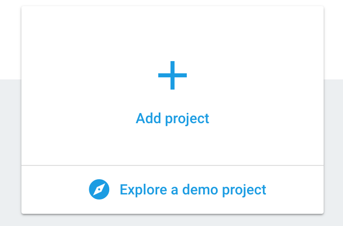

---
#### 3. Add project details

For the new project, any name is fine.

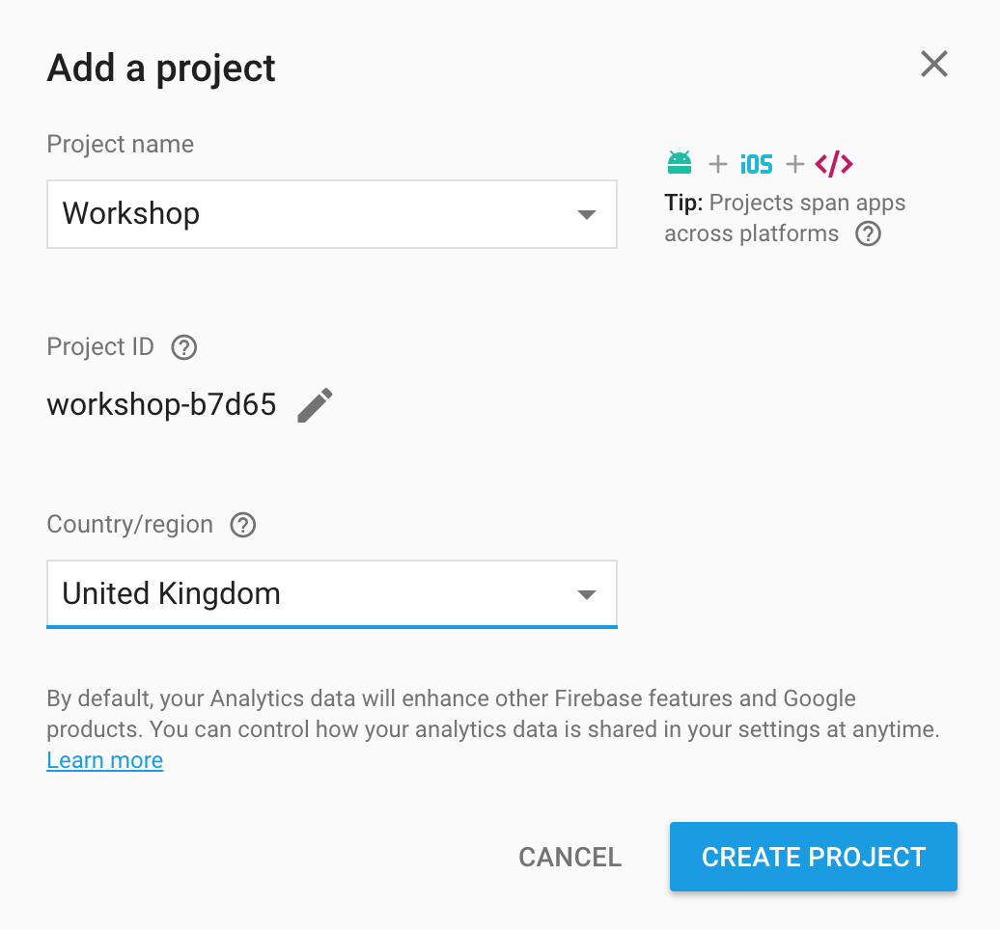

---
#### 4. Add Firebase to the Android apps

Now that we have a Firebase project, we need to add it to our Android Project

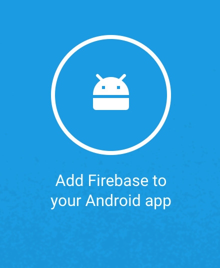

---
#### 5. Setup the Android package name

The package name must match the one in your project, in this case `com.jamescoggan.workshopapp`

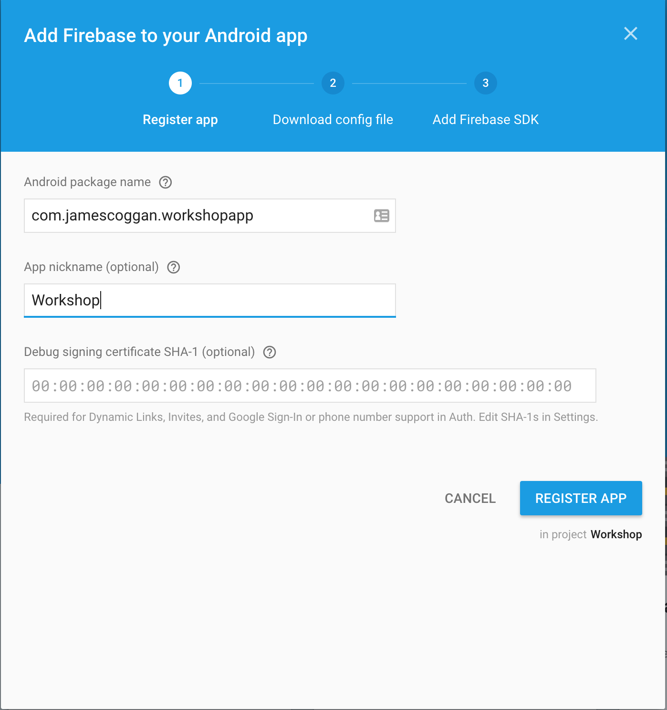

---
#### 6. Download the json file

After that the package name is setup, you need to download the JSON file, this file is used in the project to configure your Android apps with Firebase.

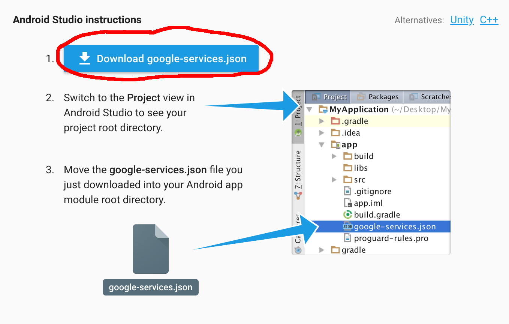

---
#### 7. Add the JSON to the apps

Place the json file as displayed Below

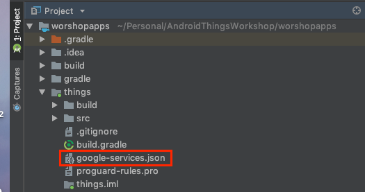


---
## Open the Firebase Console

Now open the [Firebase Console](https://console.firebase.google.com)


---
## Navigate to the authentication tab

And open the authentication tab


---
## Enable anonymous login

For this lesson we are going to use the anonymous login, but remember you need to change this for a production build.
So select the anonymous option.


and enable it.


---
## Enable the loading of the play services

Because the JSON files were missing ,the loading of the play services was disabled, so now we need to add that code again in both modules, for that:

#### Open `things/build.gradle` and go to the end of the file

```
//Todo: Add the missing google-services.json and uncomment the line below
// apply plugin: 'com.google.gms.google-services'
```

#### Remove the Todo and uncomment the code

```
apply plugin: 'com.google.gms.google-services'
```

---
## Setup Firebase

Before we can read/store data we need to connect to Firebase, then once connected we can observe the data.
So we are going to load the FirebaseApp on our app creation, and login when our activity is started.

Open the `ThingsApplication` and change is as below

```kotlin
override fun onCreate() {
    super.onCreate()

    FirebaseApp.initializeApp(this)
    Timber.plant(Timber.DebugTree())
}
```

Now we need to setup the login in firebase, open the `ThingsActivy` and create a new function called `loginFirebase()`

```kotlin  
private fun loginFirebase() {
    val firebase = FirebaseAuth.getInstance()
    firebase.signInAnonymously()
            .addOnSuccessListener { Timber.d("Firebase logged in successfully") }
            .addOnFailureListener { Timber.e("Failed to login $it") }
}
```

And login on your activity start

```Kotlin
    override fun onStart() {
        super.onStart()
        ...
        loginFirebase()
    }
```

Run the app and check on the `Logcat` console of  Android studio if Firebase logged in successfully.

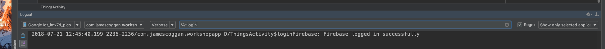

If you for some reason get stuck in this lesson, you can checkout the `firebaseLogin` branch that has the code until this point.

---
## Saving the data in the firebase database

Create a database reference property

```Kotlin
private var dbReference: DatabaseReference? = null
```

When the login is successfull we can load the database reference, so lets update the `loginFirebase` function

```kotlin
private fun loginFirebase() {
    val firebase = FirebaseAuth.getInstance()
    firebase.signInAnonymously()
            .addOnSuccessListener {
                Timber.d("Firebase logged in successfully")
                dbReference = FirebaseDatabase.getInstance().reference.child("home")
            }
            .addOnFailureListener { Timber.e("Failed to login $it") }
}
```

Now that the database is setup, we can save the button and temperature events in it, we are also adding a `light` state to handle the LED on/off.
Update the logic for the button and temperature events


```Kotlin
override fun onStart() {
    super.onStart()

    ...
    button.registerGpioCallback { gpio ->
        Timber.d("Button pressed: ${gpio.value}") // Read and print the GPIO value
        dbReference?.child("light")?.setValue(gpio.value)
        dbReference?.child("button")?.setValue(gpio.value)
        true // Return true so we continue monitoring the button events
    }

    tempSensor.open() // open the port
    tempSensor.setListener { value: Int ->
        Timber.d("Current temperature $value")
        dbReference?.child("temperature")?.setValue(value)
    }

    loginFirebase()
}
```

If you for some reason get stuck in this lesson, you can checkout the `firebase_save_data` branch that has the code until this point.

---
## Looking at the database changes in the Firebase Console

Now that you application is saving the data on the realtime database, its possible to see those changes happening in realtime, for that open the [Firebase console](https://console.firebase.google.com/u/0/)

Select your projects

Open the Database

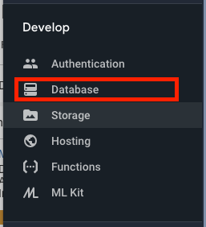

Choose the realtime database

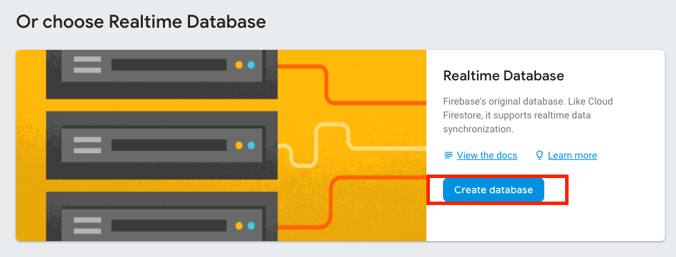

Select and enable the test mode

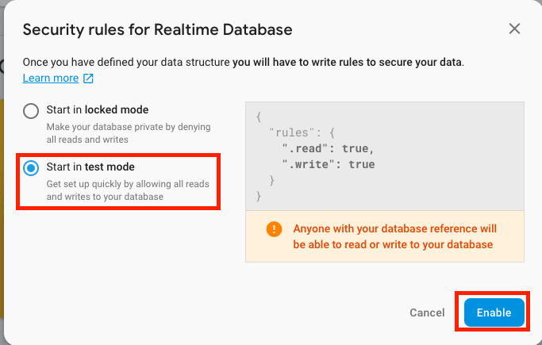

You should now start seeing the data changes from your Android Things kit to the Firebase realtime database!

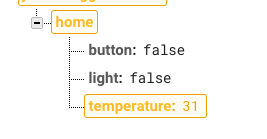

---
## Updating the LED based on the `Light` state of the database

We store the data in the realtime database, but we also want to observe it so, when the `light` object in the database changes, our LED turns on or off.

To do that, lets observe in realtime the value change of the `light` object.
Create the `observeChanges` function:

```kotlin
private fun observeChanges() {
    dbReference?.addValueEventListener(object : ValueEventListener {
        override fun onCancelled(error: DatabaseError) {
            Timber.e("Something has gone wrong: ${error.message}")
        }

        override fun onDataChange(homeValue: DataSnapshot) {
            val homeInformation = homeValue.getValue(HomeInformation::class.java) // Convert the value to the HomeInformation data class
            Timber.d("New value received: $homeInformation")
            homeInformation?.let { // If homeInformation not null
                led.value = it.light // Set the LED to the light boolean value
            }
        }

    })
}
```

And now update the `loginFirebase` function to observe the changes once Firebase is logged in:

```kotlin
private fun loginFirebase() {
    val firebase = FirebaseAuth.getInstance()
    firebase.signInAnonymously()
            .addOnSuccessListener {
                Timber.d("Firebase logged in successfully")
                dbReference = FirebaseDatabase.getInstance().reference.child("home")
                observeChanges()
            }
            .addOnFailureListener { Timber.e("Failed to login $it") }
}
```

Run the application on the device.
Now, if you press the button, the value will be store in the Firebase database and the updated object will be sent back to the device and the LED will go on.

You can also open the [Firebase console](https://console.firebase.google.com/u/0/) and change the `light` value from `true` to `false` or vice versa and the LED should go on and off accordingly.

If you for some reason get stuck in this lesson, you can checkout the `firebase_observe_data` branch that has the code until this point.

[Load lesson Four!](https://github.com/jamescoggan/AndroidThingsWorkshop/blob/master/task_four_google_assistant.md)
